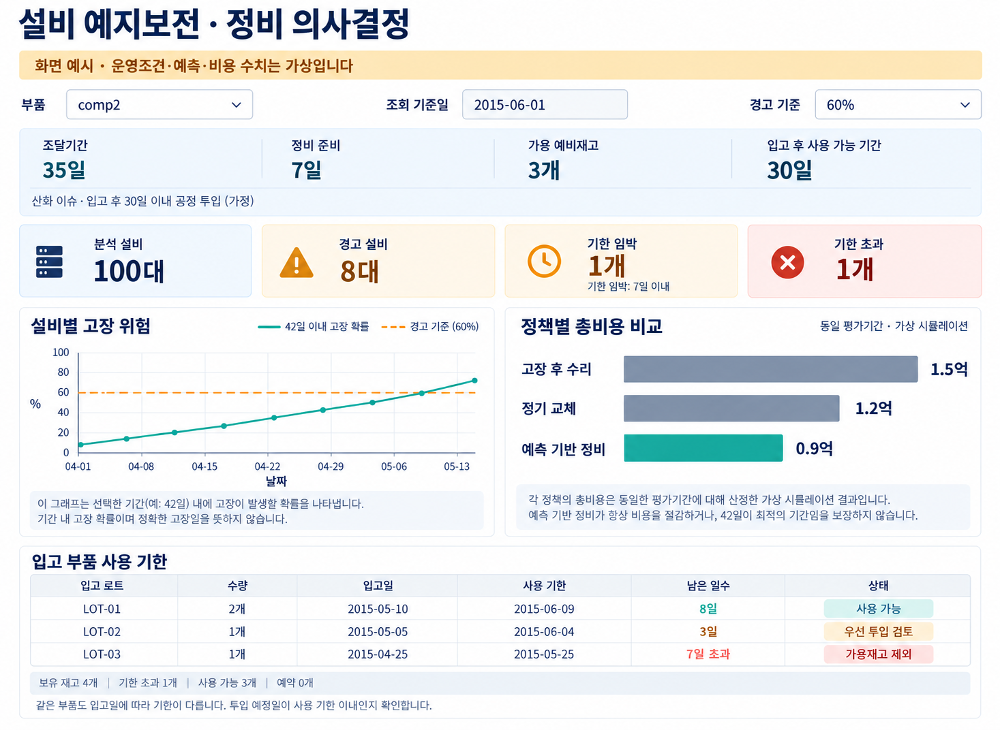

# 데이터와 구현 계획

> **목표: 고장을 미리 예측하고, 부품 조달·정비 준비시간까지 고려했을 때 비용이 가장 적게 드는 대응 방법을 찾는다.**

예를 들어 3일 뒤 고장을 알아도 부품 도착에 42일이 걸리면 대응이 늦습니다. 반대로 너무 잦은 경고는 불필요한 발주·교체 비용을 만듭니다. 두 경우를 함께 평가합니다.

## 1. 현재 데이터

**Azure PdM 공개 시뮬레이션 데이터**입니다. 실제 우리 공장에서 측정한 자료는 아닙니다. 센서 기록은 100대 설비의 `2015-01-01 06시 ~ 2016-01-01 06시`를 포함합니다.

| 파일 (`raw/azure_pdm/`) | 행 수 | 한 행의 의미 | 주요 컬럼 |
| --- | ---: | --- | --- |
| `PdM_machines.csv` | 100 | 설비 한 대의 기본 정보 | `machineID`, `model`, `age` |
| `PdM_telemetry.csv` | 876,100 | 설비 한 대의 시간별 센서값 | `datetime`, `machineID`, `volt`, `rotate`, `pressure`, `vibration` |
| `PdM_errors.csv` | 3,919 | 비치명적 오류 발생 | `datetime`, `machineID`, `errorID` |
| `PdM_maint.csv` | 3,286 | 부품 교체 이력 | `datetime`, `machineID`, `comp` |
| `PdM_failures.csv` | 761 | 부품 고장 발생 | `datetime`, `machineID`, `failure` |

- **연결 방법:** `machineID`로 같은 설비를 찾고, `datetime`으로 센서와 과거 이력을 맞춥니다.
- **센서 4종:** 전압(`volt`), 회전속도(`rotate`), 압력(`pressure`), 진동(`vibration`). 설비 단위 측정값입니다.
- **분석 대상:** 우선 `comp2` 한 종류로 시작합니다. 고장 기록은 **259건**입니다. `comp2`의 실제 부품명은 제공되지 않습니다.
- **정비와 고장의 차이:** 정비 파일에는 정기교체와 고장 후 교체가 함께 있습니다. 고장 여부는 고장 파일과 대조합니다. 정비 이력은 2014년부터 포함됩니다.
- **현재 없는 정보:** 배송기간, 재고·입고일, 입고 후 사용 가능 기간·보관 제약, 발주·교체·폐기 비용, 설비정지 시간·손실. 별도 가상 운영조건으로 정의해야 합니다.

원본 CSV 다운로드와 빈 필드·중복 키 검사를 완료했습니다. 모델 학습과 비용 계산은 아직 수행하지 않았습니다.

## 2. 구축해야 할 것

```text
센서 + 과거 오류·교체 이력 + 설비 정보
                  ↓
        기간별 comp2 고장 확률 예측
                  ↓
     재고·조달기간을 반영한 발주·정비 결정
                  ↓
      오경보·미탐·늦은 대응의 비용 계산
                  ↓
       총비용이 가장 작은 정책 비교
```

| 순서 | 구현할 내용 | 결과물 |
| --- | --- | --- |
| 1. 학습 데이터 | 최근 센서 평균·변동, 오류 횟수, 교체 후 경과일 계산 | 설비·예측시점별 특징 테이블 |
| 2. 고장예측 | 향후 7·14·30·42·60·90일 내 `comp2` 고장 여부를 학습 | 기간별 고장 확률 |
| 3. 운영조건 | 부품별 조달기간·정비 준비시간·입고 후 사용 가능 기간과 초기 재고·비용 설정 | 별도 기준정보와 입고 건별 재고 상태 |
| 4. 비용 시뮬레이션 | 날짜별 발주·입고·사용 기한·투입·폐기를 추적하고 중복 발주 방지 | 정책별 총비용·다운타임·기한 초과 수량 |
| 5. 평가·화면 | 고장 후 수리 / 정기교체 / 예측 기반 정비 비교 | 평가표와 대시보드 |

**운영조건 예시 — 모두 가정:** 조달 35일(제작 28 + 물류 7)과 정비 준비 7일을 합쳐 총 대응기간 42일, 초기 재고 0개/1개, 예방교체 300만원/건, 긴급교체 700만원/건, 정지손실 500만원/일, 재고보유 5만원/(개·일). 발주·구매 비용과 교체비에 포함되는 항목은 추가 정의합니다. 초기 재고 비교는 분석용 시나리오에서 수행하며, 운영 화면의 재고를 직접 선택하는 기능으로 만들지 않습니다.

**평가 원칙**

- 운영비용은 센서 입력에 섞지 않고, 예측을 이용한 의사결정 단계에 적용합니다.
- 과거로 학습하고 이후 기간으로 검증합니다. 미래 기록은 정답 생성에만 사용하며, 미래를 끝까지 관측하지 못한 행은 정상으로 단정하지 않습니다.
- F1뿐 아니라 **충분히 이른 경고 비율, 오경보, 늦은 경고·미탐, 다운타임, 총비용**을 함께 비교합니다.
- **‘42일 이내 고장 확률’은 ‘42일 전 경고’가 아닙니다.** 실제 확보한 준비시간을 별도로 계산합니다.
- 42일이 최적이라는 결론을 미리 정하지 않습니다. 예방교체로 고장을 회피하는 효과도 시뮬레이션 가정으로 명시합니다.

## 3. 대시보드 예시

**아래는 구현할 화면의 예시 이미지입니다. 예측·비용·경고 건수는 가상이며 실제 분석 결과가 아닙니다.**



| 화면 영역 | 확인할 내용 |
| --- | --- |
| 선택·필터 | 부품·설비·조회 기준일 선택, 경고 확률 기준 변경 |
| 부품 정보 | 조달기간·정비 준비시간·가용 예비재고·입고 후 사용 가능 기간·제약 사유 자동 표시. 조달기간·재고에는 드롭다운을 두지 않음 |
| 경고 현황 | 경고 설비 수, 대응 가능한 설비, 조달 지연 위험 |
| 고장 위험 | 선택한 설비의 기간별 고장 확률과 경고 기준 |
| 비용 비교 | 동일 평가기간의 정책별 비용과 비용 항목별 내역 |
| 재고 사용 기한 | 입고 건(로트)별 수량·입고일·사용 기한·남은 일수·상태 |
| 대응 계획 | 공정 투입 예정일이 준비 완료 이후이면서 사용 기한 이내인지 확인, 사용 기한이 빠른 재고부터 배정 |

**언제까지 사용할지:** 산화 등 보관 제약 때문에 **입고 후 공정에 투입해야 하는 기한**을 관리합니다. 예를 들어 `입고 후 30일 이내 투입 · 사유: 산화`를 부품 기준정보에 등록하면, `사용 기한 = 실제 입고 시각 + 30일`로 계산합니다. 같은 부품도 입고 시점이 다르면 사용 기한이 다르므로 로트별로 표시합니다. 이 기한은 장착 후 수명이나 교체 주기와 별개입니다. 30일은 사용자 제안의 시나리오 예시이며 comp2의 실제 사양은 아닙니다.

**재고와 연결:** 사용 기한이 지난 수량은 보유재고에는 남아 있더라도 가용재고에서 제외하고 `기한 초과`로 표시합니다. 예약·격리 수량도 제외합니다. 입고일이나 사용 가능 기간이 없으면 `기한 확인 필요`로 표시하고 자동 배정하지 않습니다. 별도로 `기한 제한 없음`이 확인된 부품과 정보 누락을 구분합니다. 실제로 투입할 수 있는 재고 중 사용 기한이 빠른 순서로 배정하며, 여러 설비에 같은 수량을 중복 배정하지 않습니다.

**발주와 연결:** `입고일 + 정비 준비시간 ≤ 공정 투입 예정일 ≤ 사용 기한`을 만족하도록 발주·입고 일정을 정합니다. 너무 늦게 도착하는 경우뿐 아니라 너무 일찍 도착해 투입 전에 기한이 지나는 경우도 평가합니다. 입고 전에는 예정일 기반의 예상 기한으로 표시하고, 실제 입고 후 확정합니다. 기한 초과에 따른 폐기·재조달 비용을 비용 비교에 포함하며, 단가는 별도 가정으로 정의합니다.

조달기간·목표 예비재고·입고 후 사용 가능 기간은 부품 기준정보에서 관리하고, 실제 가용재고는 기준일의 입출고·예약·기한 상태로 갱신합니다. 원본에 없는 재고·기한은 가정임을 표시합니다. 목업은 날짜 단위 예시이며, 실제 구현에서는 시각으로 기한을 판정하고 당일 마감 시각도 표시합니다.

이미지는 내장 `imagegen`으로 생성한 정적 목업입니다. [수정 프롬프트](assets/dashboard-example-v2.prompt.txt)

## 4. 파일 공유 안내

- 이 문서와 예시 이미지는 Git으로 공유할 수 있습니다. **원본 CSV는 `.gitignore`로 제외**되므로 팀원은 별도로 다운로드합니다.
- [데이터 출처](../DATA_SOURCES.md) · [다운로드 방법과 상세 설계](../docs/AZURE_PDM_GUIDE.md) · [원본 검사 결과](../reports/tables/azure_pdm_profile.json)
