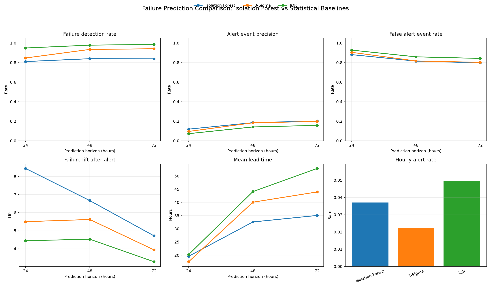

# 이상 탐지 모델 비교 결과

## 개요

- 대상: 테스트 데이터 173,800건, 실제 고장 140건
- 비교: Isolation Forest, 설비별 3-Sigma, 설비별 IQR
- 기준선 산출: 학습 구간만 사용
- 평가: 고장 전 24·48·72시간 경고

## 핵심 결과

| 모델 | 구간 | 탐지율 | 적중률 | 오경보율 | 평균 선행시간 | Lift |
|---|---:|---:|---:|---:|---:|---:|
| Isolation Forest | 24h | 81.0% | **11.9%** | **88.1%** | 19.6h | **8.45** |
| 3-Sigma | 24h | 84.7% | 9.5% | 90.5% | 17.5h | 5.50 |
| IQR | 24h | **94.9%** | 7.3% | 92.7% | **20.2h** | 4.44 |
| Isolation Forest | 48h | 83.9% | **18.5%** | **81.5%** | 32.6h | **6.67** |
| 3-Sigma | 48h | 93.4% | 18.4% | 81.6% | 40.1h | 5.62 |
| IQR | 48h | **97.8%** | 14.1% | 85.9% | **44.1h** | 4.53 |
| Isolation Forest | 72h | 83.8% | **20.3%** | **79.7%** | 35.0h | **4.71** |
| 3-Sigma | 72h | 94.1% | 19.8% | 80.2% | 43.9h | 3.93 |
| IQR | 72h | **98.5%** | 15.7% | 84.3% | **52.8h** | 3.28 |

## 결론

- **Isolation Forest:** 탐지율은 낮지만 Lift와 경고 적중률이 가장 높아 경고 신뢰도가 가장 좋다.
- **3-Sigma:** 높은 탐지율과 Isolation Forest에 가까운 적중률을 보여 가장 균형적이다.
- **IQR:** 고장 누락은 가장 적지만 경고량과 오경보가 가장 많다.

운영 목적이 경고 신뢰도라면 **Isolation Forest**, 탐지율과 경고 부담의 균형이라면 **3-Sigma**, 고장 누락 최소화가 최우선이면 **IQR**이 적합하다. 공통적으로 오경보율이 80% 이상이므로 실제 적용 전 경고 병합 간격과 임계값을 추가 조정해야 한다.

> 고장 기록은 센서 이상 자체의 정답이 아니라 이후 발생한 운영 결과다. 따라서 본 결과는 이상 분류 정확도가 아니라 고장 사전 경고의 유용성을 평가한다.
